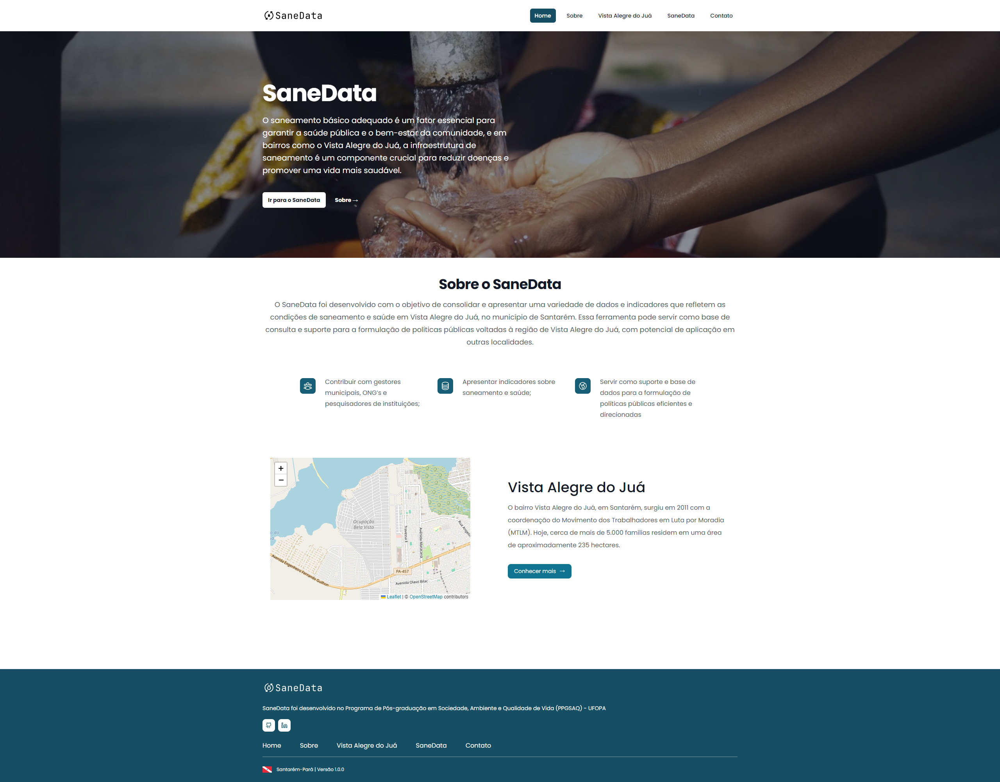

---

🔗 https://sane-data.vercel.app

Desenvolvido como parte do Programa de Pós-graduação em Sociedade, Ambiente e Qualidade de Vida (PPGSAQ) - UFOPA.

SaneData é uma ferramenta desenvolvida para consolidar e apresentar uma variedade de dados e indicadores que refletem as condições de saneamento e saúde no bairro Vista Alegre do Juá, localizado no município de Santarém, Pará.

## Objetivos do SaneData

- **Contribuir** com gestores municipais, ONGs e pesquisadores de instituições.
- **Apresentar** indicadores sobre saneamento e saúde, possibilitando uma visão mais clara das condições de vida na comunidade.
- **Servir** como suporte e base de dados para a formulação de políticas públicas que promovam melhorias na qualidade de vida e no ambiente da região.

## Equipe

- [**Ewellyn Cristina Santos de Sousa**: Criadora do SaneData e Mestranda no Programa de Pós-graduação em Sociedade, Ambiente e Qualidade de Vida (PPGSAQ) na UFOPA. ](http://lattes.cnpq.br/9282145308173973)

- [**Leônidas Luiz Volcato Descovi Filho**: Orientador e docente no PPGSAQ, UFOPA. ](http://lattes.cnpq.br/2480279163317614).

## Desenvolvimento

- [Tharlyson Ribeiro](https://www.linkedin.com/in/thjrribeiro/)

## Agradecimentos

- **Universidade Federal do Oeste do Pará (UFOPA)**  
- **Programa de Pós-graduação em Sociedade, Ambiente e Qualidade de Vida (PPGSAQ)**  
- **Fundação Coordenação de Aperfeiçoamento de Pessoal de Nível Superior (CAPES)**  

## Tecnologias Utilizadas

- **Frontend**: 
      
- **Datasets**: 
- **Deploy**: 
- **Versionamento de Código**: 
- **Linguagens**: 

## Licença

Este projeto é licenciado sob a [MIT License](LICENSE).
